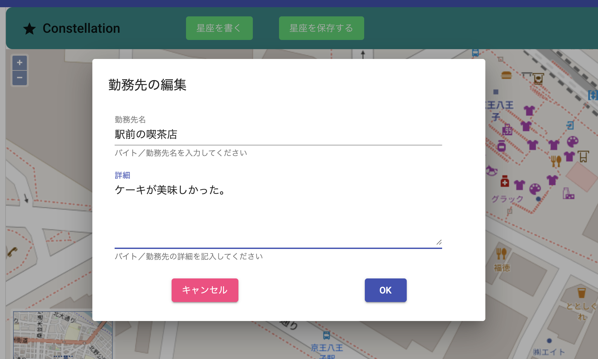

# Tobimap
## 概要
これはやめていったバイト先を地図上にプロットして星座を描くWEBアプリです。

数え切れないくらいバイトをとんでいた（＝すぐに連絡もせずに辞めていった）友人がいたのですが、
彼のバイト先を点として、線でつないでいくと何か絵が浮かび上がるんじゃないかと思って作りました。
### 対応ブラウザ
最新のGoogle Chromeをお使いください。
### 稼働環境
https://tobimap2-c2307.web.app/

firebase-hostingを利用しています。
### その他
- このアプリを使用することで、開発者や外部サーバーに個人情報が知られることはありません。
  - 入力されたデータはユーザーのブラウザでのみ処理されているからです。
## 使い方
### A. これまでのバイト先/勤務先を振り返る
1. あなたの半生を勤務先の位置と共に振り返ってください
### B. 勤務先を登録する
1. 表示されている地図から、あなたの勤務先を探し出してください。

   1. 八王子以外のところを選択する場合、地図の左下にあるミニマップを操作すると移動しやすいかもしれません。
   2. 地図は拡大縮小できます。
   3. いつか住所で検索できるようにしようと思っています。

   

2. 自分が働いた場所をクリックして勤務先の名前を記録してください。

   1. 表示されたモーダルに入力し、OKボタンを押してください。
   2. なにか思い出がある場合は「詳細」に書いておいてください。

   

3. すると、左のリストと地図に、勤務先の情報が追加されます。

   

4. 1-3を繰り返してください。なお、順番を入れ替えたい場合は、ドラッグアンドドロップで入れ替えできます。
5. 左のリストをクリックすると、クリックした勤務先に地図の中心が移ります。

### C. 星座を描く

1. さて、いくつか勤務先を登録できたでしょうか。そうしたら、「星座を描く」ボタンをクリックしてください。

2. あなたの働いてきた場所をつないだ絵が地図に描かれます。そこに何が見えますか？

   

### D. 星座を保存する

1. せっかくなので、画像にして保存しておきましょう！「星座を保存する」ボタンを押すと画像に出力できます。友人や家族、職場の同僚との話題になること間違いなしです。

   

## 開発者向け

angular 9とopenlayers 6で作っています。

### 地図周り

- openlayers で作りました。
- サービスで地図オブジェクトを作成・操作しています。
  - イベントだけコンポーネントで制御してます。
- 型をつけるのと、検索機能を入れるのが課題です。

### UI

- angular material に頼りました。
- 超感謝
  - https://note.com/3832/n/nda0b10d91a34

### CI/CD

github actions使ってみてます。

### デプロイ

- ほぼここに書いてあります。
  - https://qiita.com/rubytomato@github/items/b83caa01fc9c4993f526
- publish は`dist/front`  です
